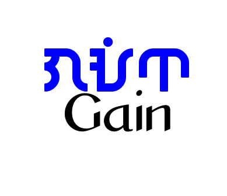

## Welcome to Sir Gain's GitHub Pages

<iframe width="560" height="315" src="https://www.youtube.com/embed/8Gv0H-vPoDc" title="YouTube video player" frameborder="0" allow="accelerometer; autoplay; clipboard-write; encrypted-media; gyroscope; picture-in-picture" allowfullscreen></iframe>

# Header 1
## Header 2
### Header 3

This is an example of a normal text. This is in *italics*, this one is in **bold** print and this is `code`.

> This is an example of a text with **blockquote**. Note that it is indented from the left. This is useful if you are quoting long texts or want to highlight a paragraph or sentence.

Below is the use of the ` to usually show computer codes
```code
This is an example programming code

for(i=0;i<10;i++){
  echo 'GitHub rocks!\n';
}
```
### This is an ordered list
1. Static Site Generator
2. Content Management System
3. Site Builders

### This is an unordered list
- Static Site Generator
- Content Management System
- Site Builders

### Table

| Time/Day | M | T | W | Th | F |
-----------|---|---|---|----|---|
| 8:00 AM |  |Gonzalez B | Gonzalez A | Gonzalez B | Gonzalez A |
| 11:00 AM |  | Campion B | Campion A |  |  |
| 12:45 PM |  | Chabanel B | Chabanel A | Brebeuf B | Brebeuf A |
| 1:45 PM |  | Brebeuf B | Brebeuf A | Chabanel B | Chabanel A |
| 2:45 PM | Consultation |  |  | Campion B | Campion A |




### Links

[`facebook`](https://www.facebook.com/sirgain)
[`twitter`](https://www.twitter.com/sirgain)
[`Gain's Nook`](http://sirgain.droppages.com/)

